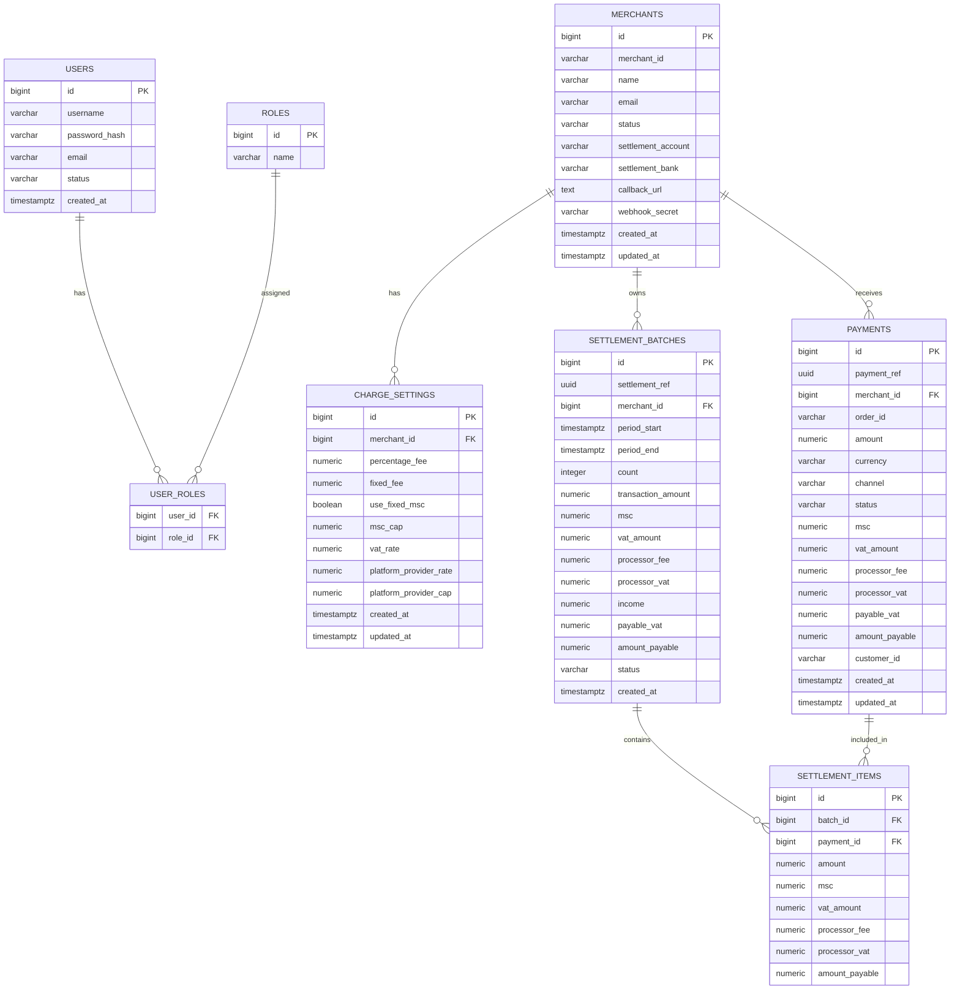

# MiniPay PSP

A payment service provider simulation built with **Java 17, Spring Boot 3, PostgreSQL, Flyway, Docker**.

---

## 🚀 Architecture
<pre> ```mermaid flowchart LR A[Client / Merchant] -->|API Requests| B[MiniPay App (Spring Boot)] B --> C[(PostgreSQL <br/> Flyway migrations)] B --> D[External Processor Simulator] B --> E[Webhook Dispatcher] --> A subgraph Observability B -.-> F[Actuator / Metrics / Logs] end ``` </pre>

---

## 2. ERD (Mermaid)


---

## 3. Setup

### Prereqs (local)
- Java 17+ (OpenJDK / Temurin)
- Maven 3.8+
- Docker & Docker Compose (for containerized run)
- Optional: Postman or curl for API testing

### Environment variables
Copy `.env.example` → `.env` and update secrets. Example `.env`:
```
DB_URL=jdbc:postgresql://db:5432/minipay
DB_USER=minipay
DB_PASS=secret
JWT_SECRET=replace-with-secure-base64
SPRING_PROFILES_ACTIVE=dev
```

### Run with Docker (recommended)
```bash
# from project root
cp .env .env   # then edit .env to set secrets
docker-compose up --build
```

The app will run at `http://localhost:8080` and Flyway will apply migrations on startup.

### Run locally (no Docker)
1. Start a local Postgres (listen on default port) and create DB/user or use `.env` values.
2. Run migrations: `mvn flyway:migrate -Dflyway.url=jdbc:postgresql://localhost:5432/minipay -Dflyway.user=minipay -Dflyway.password=secret`
3. Start app: `mvn spring-boot:run`

---

## 4. How to run migrations
Migrations using Flyway are applied automatically on app startup. To run manually:
```bash
mvn flyway:migrate -Dflyway.url=${DB_URL} -Dflyway.user=${DB_USER} -Dflyway.password=${DB_PASS}
```

Migration files are in `src/main/resources/db/migration` (V1__init.sql included).

---

## 5. Start the app & open Swagger
- Docker: `docker-compose up --build` → Swagger UI: `http://localhost:8080/swagger-ui/index.html`
- Local: `mvn spring-boot:run` → same Swagger URL

Actuator health: `http://localhost:8080/actuator/health`

---

## 6. Example curl requests

**Register (seeded admin present; registration route to be implemented during Day 3)**
```bash
# login (if /auth/login implemented)
curl -X POST http://localhost:8080/api/auth/login -H "Content-Type: application/json" -d '{"username":"admin","password":"password"}'
```

**Get merchants (requires Authorization: Bearer <token>)**
```bash
curl -H "Authorization: Bearer ${TOKEN}" "http://localhost:8080/api/merchants?page=0&size=20"
```

**Create payment (sample)**
```bash
curl -X POST http://localhost:8080/api/payments \
  -H "Content-Type: application/json" \
  -H "Authorization: Bearer ${TOKEN}" \
  -d '{
    "merchantId":"MERCH-001",
    "orderId":"ORDER-123",
    "amount":1000,
    "currency":"NGN",
    "channel":"CARD",
    "customerId":"CUST-001"
  }'
```

---

## 7. Webhook verification guide (HMAC SHA256)

When sending webhook callbacks to merchants, sign the payload using HMAC-SHA256 with the merchant `webhookSecret` and include it in `X-Signature` header (hex or base64).

### Java verification example
```java
import javax.crypto.Mac;
import javax.crypto.spec.SecretKeySpec;
import java.util.Base64;

public static String hmacSha256(String secret, String payload) throws Exception {
    Mac mac = Mac.getInstance("HmacSHA256");
    mac.init(new SecretKeySpec(secret.getBytes(StandardCharsets.UTF_8), "HmacSHA256"));
    byte[] sig = mac.doFinal(payload.getBytes(StandardCharsets.UTF_8));
    return Base64.getEncoder().encodeToString(sig);
}
```

On merchant side: compute same HMAC and compare in constant time. Reject requests without valid signature.

---

## 8. Decision log (tradeoffs & assumptions)
- **Postgres + Flyway** chosen because challenge explicitly requests SQL migrations and relational constraints. Easier to express joins and transactional behavior for settlements.
- **UUID refs** for payments & settlements for globally unique identifiers and easier reconciliation.
- **Monetary types:** use `NUMERIC(19,2)` for amounts and `NUMERIC(19,4)` for VAT rates to avoid floating errors; use `BigDecimal` in Java.
- **BCrypt** for password hashing (security best-practice). Seed user uses placeholder hash for dev.
- **Simplifications:** Processor simulation is a simple endpoint that flips payment status; real processors would use async flows and retries.
- **Indexes:** Added indexes on `(merchant_id, created_at)` for payments and settlement_batches to support common queries and pagination.

---

## 9. Test strategy & how to run tests
- **Unit tests:** target services (fee calculator, webhook util, auth) — aim ≥80% coverage for services/utils.
- **Slice tests:** `@DataJpaTest` for repositories.
- **Integration tests:** Testcontainers (Postgres) for end-to-end flows (payment -> settlement generation -> webhook).
- Run all tests:
```bash
mvn test
```

CI (to add): GitHub Actions workflow to run build, tests, Checkstyle/Spotless, and JaCoCo coverage.

---

## 10. Performance notes & indexes added
- Pagination is mandatory on list endpoints (use `Pageable` in Spring Data JPA).
- Indexes (see `V1__init.sql`) on `payments(merchant_id, created_at)` and `settlement_batches(merchant_id, created_at)`.
- Consider moving hot data (payments) to partitioned tables or read replicas for very large volumes.
- For webhooks, use async delivery with retries and exponential backoff (DLQ) in production.

---

## What's included now (Day 1 & Day 2)
- Dockerized app + Postgres, Flyway migration (V1) — Day 1 completed.
- JPA Entities and Repositories for full data model — Day 2 completed.
- Seed data runner for admin user and a test merchant.
- README with architecture, ERD, setup, migrations, and verification guide.

---

## Next recommended tasks (Day 3+)
1. Security: JWT auth, BCrypt hashing, login rate limiting.
2. Merchant CRUD and ChargeSetting endpoints (Maker/Checker flow optional).
3. Payment API: fee calculation (msc, vat, processorFee, payableVat, amountPayable).
4. Processor simulator and webhook dispatcher (HMAC signature).
5. Settlement batch generation and export (CSV/XLSX).
6. Testing (unit, integration with Testcontainers) and CI pipeline.

---
